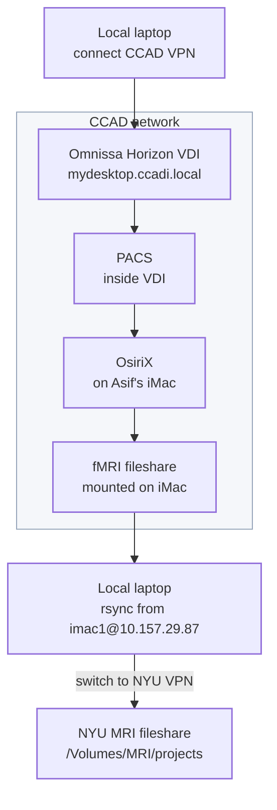

# Getting Data from CCAD

Use this workflow when data must be exported from CCAD PACS/clinical systems.

## Data Flow



Most final project copies should go under:

```text
/Volumes/MRI/projects
```

Access to `/Volumes/MRI/projects` requires NYU VPN and the NYU MRI fileshare mounted locally.

## Requirements

- CCAD VPN works.
- Omnissa Horizon VDI works.
- The CCAD account has access to PACS and the Imaging Desktop VDI pool.
- Asif's iMac is reachable at `10.157.29.87`.
- OsiriX is available on Asif's iMac.
- NYU VPN works if the final destination is `/Volumes/MRI/projects`.

## Step 1: Connect CCAD VPN

Connect FortiClient to:

```text
CCAD-ZTNA
```

Verify:

```bash
ssh imac1@10.157.29.87
```

## Step 2: Open the CCAD VDI

While still on CCAD VPN, open **Omnissa Horizon Client**.

```text
mydesktop.ccadi.local
```

Log in with the CCAD account and open:

```text
Imaging Desktop
```

## Step 3: Export from PACS to OsiriX

PACS is inside the CCAD VDI. Inside the **Imaging Desktop**:

1. Open PACS.
2. Find the target patient/study.
3. Send/export the study to OsiriX.

Expected clinical apps:

- Synapse PACS
- SyngoVia
- BrainLab

BrainLab station:

```text
CCADBLP050.CCADI.LOCAL
```

## Step 4: Remote Into Asif's iMac

After sending the study from PACS to OsiriX, remote into Asif's iMac to confirm it arrived. On macOS Finder:

1. Press `Command-K`.
2. Connect to:

```text
vnc://10.157.29.87
```

3. Log in as:

```text
imac1
```

Do not document the password.

## Step 5: Export DICOMs from OsiriX

On Asif's iMac:

1. Open OsiriX.
2. Confirm the PACS transfer arrived.
3. Export the study as DICOM.
4. Save the DICOMs to a target folder on the fMRI fileshare mounted on Asif's iMac.

## Step 6: Pull Data to Local

Keep CCAD VPN connected. From the local Mac, use SSH/rsync from Asif's iMac.

```bash
rsync -avh imac1@10.157.29.87:/path/on/fMRI/fileshare/ /local/target/folder/
```

## Step 7: Copy to NYU MRI Fileshare

After the data is local:

1. Disconnect CCAD VPN.
2. Connect NYU VPN.
3. Mount the NYU MRI fileshare.
4. Copy the local data into the relevant project folder.

```bash
rsync -avh /local/target/folder/ /Volumes/MRI/projects/<project-folder>/
```
