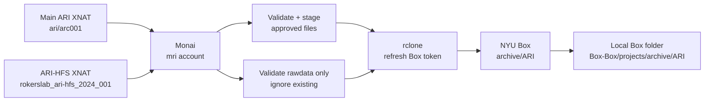

# ARI Box Archive

This page documents the ARI archive workflow that backs up selected XNAT data from Monai to NYU Box.

There are two ARI-related projects on XNAT, and they are handled differently:

```text
main ARI project:
  /mnt/CTP/xnat-main/xnat-data/archive/ari/arc001
  scheduled nightly sync
  derivatives + validated rawdata

ARI-HFS project:
  /mnt/CTP/xnat-main/xnat-data/archive/rokerslab_ari-hfs_2024_001/arc001
  manual rawdata-only supplement
  uses --ignore-existing so it does not overwrite main ARI files
```

The Box target is shared:

```text
box:archive/ARI/
```

So the practical question is not just "how do we sync ARI to Box?" It is also "which XNAT project is the source, and should it be allowed to overwrite anything already in Box?"

The public docs should not contain Box JWT secrets, client secrets, passwords, or private keys. For those details, use the private local setup note:

```text
/Users/pw1246/Desktop/info/info about archive using box.txt
```

The repo also has an ignored local secrets area:

```text
/Users/pw1246/Documents/GitHub/wpdocs/secrets/
```

## Purpose

The archive job copies validated ARI data from XNAT archive storage to Box so there is a project-level backup outside XNAT.

The main ARI nightly backup covers:

```text
derivatives:
  ari-validation
  freesurfer
  v123seg

rawdata:
  anat T1w and FLAIR pairs
  func plus func fieldmaps as an all-or-nothing group
  dwi plus reverse-b0 fieldmap as an all-or-nothing group
  perf ASL v2
```

The HFS workflow is different. It is a manual rawdata-only supplement from the separate `rokerslab_ari-hfs_2024_001` XNAT project. It uploads with `--ignore-existing`, so HFS can add missing validated rawdata but should not replace files already copied from the cleaner main ARI project.

## XNAT Projects

| XNAT project | Source path on Monai | Sync script | What it syncs | Overwrite behavior |
|---|---|---|---|---|
| Main ARI | `/mnt/CTP/xnat-main/xnat-data/archive/ari/arc001/` | `/home/mri/bin/sync_ari_to_box.sh` | Derivatives and validated rawdata. Runs nightly from cron. | Normal rclone idempotent copy; skips unchanged files. |
| ARI-HFS | `/mnt/CTP/xnat-main/xnat-data/archive/rokerslab_ari-hfs_2024_001/arc001` | `/home/mri/bin/sync_hfs_rawdata_to_box.sh` | Validated rawdata only. Run manually after dry-run review. | Uses `--ignore-existing`; adds missing files without overwriting main ARI Box files. |

## Architecture



The important idea is:

```text
main ARI XNAT -> Monai validation/staging -> rclone copy -> Box archive
ARI-HFS XNAT -> Monai rawdata-only staging -> rclone --ignore-existing -> Box archive
```

## Machine

| Item | Value |
|---|---|
| Host | `monai.abudhabi.nyu.edu` |
| SSH | `ssh -p 4410 mri@monai.abudhabi.nyu.edu` |
| User | `mri` |
| Home | `/home/mri` |
| XNAT ARI root | `/mnt/CTP/xnat-main/xnat-data/archive/ari/arc001/` |
| Box mount | `/home/mri/box-mount/` |
| Box path on Monai | `/home/mri/box-mount/archive/ARI/` |
| Local Box path | `/Users/pw1246/Library/CloudStorage/Box-Box/projects/archive/ARI` |

Do not put the Monai password in public documentation.

## Box and rclone

Box is mounted on Monai through `rclone` using a Box JWT app. The JWT configuration, private key, passphrase, Box app details, and client secret are private.

Private credential details are in:

```text
/Users/pw1246/Desktop/info/info about archive using box.txt
```

Operational files on Monai:

| File | Purpose |
|---|---|
| `/home/mri/bin/rclone` | rclone binary. |
| `/home/mri/.config/rclone/rclone.conf` | rclone config for the Box remote. |
| `/home/mri/.box_config.json` | Box JWT config used by token refresh script. Private. |
| `/home/mri/bin/box_token.py` | Refreshes the Box JWT token and updates `rclone.conf`. |
| `/home/mri/bin/mount_box.sh` | Refreshes token and remounts Box FUSE. |

Check mount:

```bash
mountpoint ~/box-mount
```

Manual remount:

```bash
~/bin/mount_box.sh
```

If the mount looks empty, remount first. The Box FUSE view can show stale directory state.

## Active Scripts

All active scripts live on Monai under:

```text
/home/mri/bin/
```

| Script | Status | Purpose |
|---|---|---|
| `sync_ari_to_box.sh` | active cron script | Syncs ARI derivatives and validated rawdata to Box. |
| `ari_rawdata_stage.py` | active helper | Validates rawdata modality groups and stages approved files. |
| `sync_hfs_rawdata_to_box.sh` | manual | Adds HFS rawdata to the same Box target without overwriting existing ARI files. |
| `box_token.py` | active helper | Generates a fresh Box token for rclone. |
| `mount_box.sh` | active helper | Refreshes token and mounts Box. |

Old scripts may remain in `/home/mri/bin/` for reference, but `sync_ari_to_box.sh` is the main active ARI sync script.

## Manual ARI Sync

Run these on Monai.

All subjects:

```bash
/home/mri/bin/sync_ari_to_box.sh --all
```

Dry-run all subjects:

```bash
/home/mri/bin/sync_ari_to_box.sh --dry-run --all
```

One subject:

```bash
/home/mri/bin/sync_ari_to_box.sh sub-0238
```

One subject dry-run:

```bash
/home/mri/bin/sync_ari_to_box.sh --dry-run sub-0238
```

Multiple subjects:

```bash
/home/mri/bin/sync_ari_to_box.sh sub-0238 sub-0853
```

Accepted subject formats:

```text
sub-0238
238
Subject_0238_ses_01
```

No arguments intentionally behaves like `--all` for cron compatibility.

## Manual HFS Sync

HFS source:

```text
/mnt/CTP/xnat-main/xnat-data/archive/rokerslab_ari-hfs_2024_001/arc001
```

The HFS sync uploads with `--ignore-existing`, so it can add missing validated rawdata but should not overwrite files already copied from the main ARI project.

Dry-run one HFS subject:

```bash
/home/mri/bin/sync_hfs_rawdata_to_box.sh --dry-run sub-0447
```

Dry-run all HFS sessions:

```bash
/home/mri/bin/sync_hfs_rawdata_to_box.sh --dry-run --all
```

Full HFS upload, after reviewing dry-run:

```bash
/home/mri/bin/sync_hfs_rawdata_to_box.sh --all
```

## Source and Target Layout

XNAT source structure:

```text
/mnt/CTP/xnat-main/xnat-data/archive/ari/arc001/
  Subject_XXXX_ses_YY/
    RESOURCES/
      rawdata/
      ari-validation/
      freesurfer/
      v123seg/
```

Box target structure:

```text
box:archive/ARI/
  derivatives/
    ari-validation/sub-YYYY/
    freesurfer/sub-YYYY/
    v123seg/sub-YYYY/
  rawdata/
    sub-YYYY/ses-YY/
      anat/
      func/
      fmap/
      dwi/
      perf/
```

Subject IDs are normalized to 4-digit BIDS IDs:

```text
Subject_0238_ses_01 -> RESOURCES/rawdata/sub-238 -> Box sub-0238
```

## Derivative Rules

| Resource | Rule |
|---|---|
| `ari-validation` | Copy `ari-validation-details.txt` if present. |
| `v123seg` | Copy only if exactly four `*.benson2025*.mgz` files are present. |
| `freesurfer` | Copy only if `mri/aparc+aseg.mgz` exists. |

Derivative sync is idempotent: rclone skips files already on Box when size and mtime match.

## Rawdata Rules

Rawdata staging is handled by:

```text
/home/mri/bin/ari_rawdata_stage.py
```

High-level rules:

| Modality | Rule |
|---|---|
| `anat` | Copy T1w and FLAIR NIfTI/JSON pairs when both files exist. |
| `func` + func `fmap` | All-or-nothing group. Required BOLD and fieldmap files must pass expected shape/TR and `IntendedFor` checks. |
| `dwi` + reverse-b0 | All-or-nothing group. Uses the updated ARI validator categories: v1 DWI-only, v1.5 pilot with matching reverse-b0, and v2 with matching reverse-b0. |
| `perf` | v2 ASL only for now. Copy ASL NIfTI/JSON pair when valid. |

If a modality group fails validation, that group is skipped rather than partially uploaded.

Current DWI backup behavior accepts:

```text
v1 DWI-only:
  DWI dimensions 104 x 104 x 72 x 105, TR 3.2 s
  accepted when no diffusion reverse-b0 fieldmap is present

v1.5 pilot:
  v1 DWI plus matching reverse-b0 fieldmap
  reverse-b0 dimensions 104 x 104 x 72, RepetitionTime 3.2 s

v2:
  DWI dimensions 104 x 104 x 75 x 105, TR 3.2 s
  matching reverse-b0 dimensions 104 x 104 x 75, RepetitionTime 3.2 s
```

Legacy v1 reverse-b0 fieldmaps with RepetitionTime 3.6 s are recognized for diagnosis but are not accepted for backup. When a reverse-b0 is present, the DWI JSON and accepted reverse-b0 JSON must match on `EchoTime`, `RepetitionTime`, and `EffectiveEchoSpacing`.

## Current Status Snapshot

Latest private operational note checked:

```text
Main ARI: 2026-06-04
ARI-HFS: 2026-06-08 after the DWI backup logic update
```

Main ARI dry-run after the rawdata manifest refactor:

```text
val=208
fs=207
v123=205
t1w=208
flair=205
func=201
func_fmap_pairs=402
dwi=203
revb0_pairs=203
perf=201
func_skipped=7
dwi_skipped=1
perf_skipped=1
skipped=3
```

HFS all-session dry-run after updating DWI handling:

```text
sessions=325
t1w=319
flair=315
func=297
func_fmap_pairs=596
dwi=288
revb0_pairs=156
perf=202
func_skipped=27
dwi_skipped=19
perf_skipped=107
skipped=58
```

The full main ARI rawdata backfill had not been manually launched when the private note was written. The nightly cron uses the active `sync_ari_to_box.sh` script. The HFS sync remains manual and should be run only after reviewing dry-run output.

## Cron Jobs

Check cron on Monai:

```bash
crontab -l
```

Current relevant jobs:

```cron
*/50 * * * * /home/mri/bin/mount_box.sh >> /home/mri/.box_mount.log 2>&1
0 3 * * * /home/mri/bin/mount_box.sh >> /home/mri/.box_mount.log 2>&1 && /home/mri/bin/sync_ari_to_box.sh >> /home/mri/.sync_ari_to_box.log 2>&1
```

Meaning:

```text
every 50 minutes:
  refresh Box token and remount FUSE

every night at 03:00:
  refresh token, remount, run ARI sync
```

Cron persists through VM reboots. The FUSE mount itself does not persist through reboots, so cron remounts it.

## Logs

| Log | Purpose |
|---|---|
| `/home/mri/.box_mount.log` | Box token refresh and mount logs. |
| `/home/mri/.sync_ari_to_box.log` | ARI nightly/manual sync logs. |
| `/home/mri/.sync_hfs_rawdata_to_box.log` | HFS manual sync logs. |

Check logs when a subject is missing or a sync appears to stall.

## Troubleshooting

Box mount is empty or hanging:

```bash
~/bin/mount_box.sh
```

If rclone reports an empty token:

```bash
/opt/miniconda3/bin/python3 ~/bin/box_token.py
```

If rclone reports `403 Forbidden`, the Box app may not be authorized by a Box admin. Check the private setup note for the Box app details.

If a new subject is not appearing in Box:

```bash
~/bin/sync_ari_to_box.sh --dry-run sub-XXXX
```

Then check:

```bash
/home/mri/.sync_ari_to_box.log
```

Common skip reasons:

```text
no rawdata/sub-* folder
func/fmap group failed backup checks
DWI/reverse-b0 does not match an accepted backup category or failed checks
perf is not v2 or failed checks
incomplete derivative resource
```

If Monai was rebooted:

```bash
~/bin/mount_box.sh
```

The nightly sync should still run at 03:00 if cron is intact.
