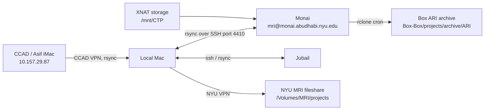

# Data Transfer & Sync

This page collects the practical commands for moving data between the local Mac, Monai, Jubail, XNAT storage, CCAD/Asif's iMac, Box, and NYU fileshares.

For the machine inventory, see [Machines and Fileshares](../getting-started/machines-and-fileshares.md).

## Pick the Route

| From | To | Network / access | Usual command |
|---|---|---|---|
| Local Mac | Monai | NYU/NYUAD network | `rsync -e "ssh -p 4410"` |
| Monai | Local Mac | NYU/NYUAD network | `rsync -e "ssh -p 4410"` |
| Local Mac | Jubail | NYUAD network / VPN | `jubail`, `rsync`, `scp` |
| XNAT storage | Monai | Already mounted on Monai | direct filesystem paths under `/mnt/CTP` |
| XNAT nodes | Local Mac / admin shell | NYU/NYUAD network | `ssh -p 4410 pw1246@<ip>` |
| CCAD PACS/OsiriX | Local Mac | CCAD VPN first | `rsync imac1@10.157.29.87:...` |
| Local Mac | NYU MRI fileshare | NYU VPN | copy or `rsync` to `/Volumes/MRI/projects` |
| Monai/XNAT archive | Box ARI archive | Monai cron/rclone | ARI Box Archive scripts |

## Mental Map



## General Rules

Use `rsync` for directories and resumable transfers. Use `scp` for one-off files.

Always dry-run first when copying large or important data:

```bash
rsync -avhn source/ destination/
```

Then remove `-n` to actually copy:

```bash
rsync -avh source/ destination/
```

Trailing slash matters:

```text
source/   copies the contents of source
source    copies the source folder itself
```

Useful flags:

| Flag | Meaning |
|---|---|
| `-a` | archive mode; preserve directory structure and metadata |
| `-v` | verbose |
| `-h` | human-readable sizes |
| `-n` | dry-run |
| `--progress` | show file progress |
| `--ignore-existing` | only add missing files; do not overwrite |
| `--delete` | delete destination files missing from source; use carefully |

## Monai

Connect:

```bash
ssh -p 4410 mri@monai.abudhabi.nyu.edu
```

Local alias:

```bash
monai
```

When using `rsync`, pass the SSH port with `-e "ssh -p 4410"`:

```bash
rsync -avh -e "ssh -p 4410" /local/path/ mri@monai.abudhabi.nyu.edu:/remote/path/
```

Pull from Monai:

```bash
rsync -avh -e "ssh -p 4410" mri@monai.abudhabi.nyu.edu:/remote/path/ /local/path/
```

Use `scp -P 4410` for a single file:

```bash
scp -P 4410 file.nii.gz mri@monai.abudhabi.nyu.edu:/home/mri/
```

Monai-side fileshare mappings:

| macOS path | Monai path | Purpose |
|---|---|---|
| `/Volumes/MRI/projects` | `/mnt/mri/projects` | NYU MRI project fileshare |
| `/Volumes/CTP-XNAT` | `/mnt/CTP` | CTP/XNAT fileshare |

## Jubail

Local alias:

```bash
jubail
```

The alias connects to:

```bash
ssh pw1246@jubail.abudhabi.nyu.edu
```

Use Jubail for HPC jobs. Use `rsync` to stage data to/from the cluster, then run jobs from the appropriate project/scratch location.

Example pattern:

```bash
rsync -avh /local/project/ pw1246@jubail.abudhabi.nyu.edu:/remote/project/
```

If the `jubail` alias does not resolve, check VPN/network context first.

## XNAT Storage and Nodes

XNAT web/API endpoint:

```text
10.230.12.52
```

XNAT archive storage is visible on Monai under:

```text
/mnt/CTP/xnat-main/xnat-data/archive/
```

ARI examples:

```text
/mnt/CTP/xnat-main/xnat-data/archive/ari/arc001/
/mnt/CTP/xnat-main/xnat-data/archive/rokerslab_ari-hfs_2024_001/arc001/
```

XNAT worker/admin nodes:

```text
10.230.12.52
10.230.12.53
10.230.12.54
10.230.12.55
10.230.12.58
10.230.12.90
10.230.12.146
10.230.12.121
10.230.12.122
10.230.12.123
10.230.12.132
```

SSH pattern:

```bash
ssh -p 4410 pw1246@10.230.12.53
```

Common storage on XNAT nodes:

```text
/mnt/xnat_storage
```

## CCAD to Local to NYU MRI Fileshare

CCAD transfer is a two-network workflow. Start on CCAD VPN, then switch to NYU VPN.

High-level flow:

```text
CCAD VDI -> PACS -> OsiriX on Asif's iMac -> fMRI fileshare -> local Mac -> NYU MRI fileshare
```

Use CCAD VPN for:

```text
mydesktop.ccadi.local
10.157.29.87
vnc://10.157.29.87
```

Pull exported DICOMs from Asif's iMac:

```bash
rsync -avh imac1@10.157.29.87:/path/on/fMRI/fileshare/ /local/target/folder/
```

Then switch VPNs:

1. Disconnect CCAD VPN.
2. Connect NYU VPN.
3. Mount `/Volumes/MRI/projects`.
4. Copy the local data to the project folder.

```bash
rsync -avh /local/target/folder/ /Volumes/MRI/projects/<project-folder>/
```

See [Getting Data from CCAD](../ccad/data-from-ccad.md) for the full CCAD workflow.

## NYU MRI and CTP-XNAT Fileshares

Common local macOS mount points:

```text
/Volumes/MRI/projects
/Volumes/CTP-XNAT
```

Use `/Volumes/MRI/projects` as the final home for most project copies.

Use `/Volumes/CTP-XNAT` for XNAT-related storage and pipeline data.

These require NYU VPN or the correct NYUAD network context.

## Box ARI Archive

Local Box path:

```text
/Users/pw1246/Library/CloudStorage/Box-Box/projects/archive/ARI
```

The ARI Box archive is maintained from Monai using rclone and cron. Do not manually overwrite archive files unless you know why.

Main sync docs:

```text
/home/mri/bin/sync_ari_to_box.sh
/home/mri/bin/sync_hfs_rawdata_to_box.sh
```

See [ARI Box Archive](ari-box-archive.md) for the full archive workflow.

## Quick Checks

Check which network you are on:

```bash
ssh -p 4410 -o BatchMode=yes -o ConnectTimeout=8 mri@monai.abudhabi.nyu.edu hostname
```

Check Asif's iMac while on CCAD VPN:

```bash
ssh -o BatchMode=yes -o ConnectTimeout=8 imac1@10.157.29.87 hostname
```

Check local mounts:

```bash
ls /Volumes/MRI/projects
ls /Volumes/CTP-XNAT
ls /Users/pw1246/Library/CloudStorage/Box-Box/projects/archive/ARI
```

## Common Mistakes

| Problem | Fix |
|---|---|
| `rsync` to Monai fails | Add `-e "ssh -p 4410"`. |
| `scp` to Monai fails | Use uppercase `-P 4410`, not lowercase `-p`. |
| `/Volumes/MRI/projects` missing | Connect NYU VPN and remount the fileshare. |
| Asif's iMac unreachable | Connect CCAD VPN first. |
| CCAD data cannot go directly to MRI fileshare | Pull locally on CCAD VPN, then switch to NYU VPN and upload. |
| Accidentally overwriting archive data | Use dry-run first and consider `--ignore-existing`. |

## Safer Copy Template

Use this when unsure:

```bash
rsync -avhn source/ destination/
```

Review the planned copy. If it looks correct:

```bash
rsync -avh source/ destination/
```
