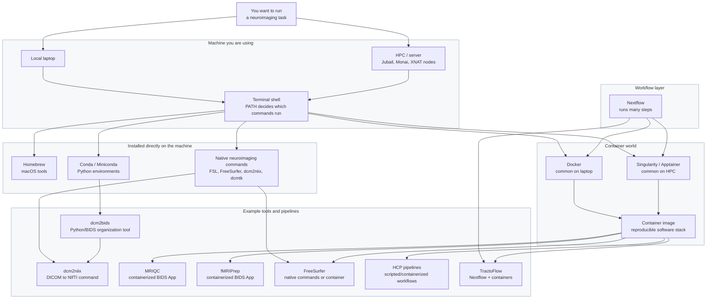

# Environment

This page gives a big-picture map of `python`, `pip`, conda, Miniconda, Homebrew, Docker, Singularity/Apptainer, Nextflow, and common neuroimaging tools such as `dcm2niix`, `dcm2bids`, MRIQC, FreeSurfer, fMRIPrep, HCP pipelines, and TractoFlow.

Neuroimaging work uses many different kinds of software. You will likely need to run `dcm2niix` to convert DICOMs, `dcm2bids` to organize a dataset, MRIQC to check image quality, FreeSurfer to reconstruct anatomy, fMRIPrep to preprocess fMRI, HCP pipelines for structural or functional processing, and TractoFlow for diffusion MRI.

These tools do not all live in the same kind of place. Some are simple terminal commands. Some are Python scripts. Some are full pipelines with hundreds of dependencies. Some are easiest to run inside Docker on a laptop. Some are meant to run with Singularity or Apptainer on an HPC cluster.

That is why we need the idea of an **environment**.

An environment answers a simple question:

```text
When I type this command, what software world am I standing inside?
```

That "software world" includes which `python` is active, where packages are installed, which terminal commands are visible, and whether the workflow is using the host machine directly or a container image.

For the current local macOS setup, command locations, install rules, and environment inventory, see [Workstation Setup](../getting-started/workstation-setup.md).

## The Big Picture

Think of neuroimaging software in four rough layers.

First, there is your **machine**: your laptop, Monai, Jubail, or another server. The machine has a shell, a `PATH`, and installed commands.

Second, there are **package managers**: Homebrew, conda, and pip. These install software into the machine or into a Python environment.

Third, there are **containers**: Docker and Singularity/Apptainer. These let you run a whole packaged software world without installing every dependency by hand.

Fourth, there are **workflow systems**: tools like Nextflow that coordinate many processing steps, often using containers underneath.

Most confusion comes from mixing these layers together. For example, fMRIPrep uses Python internally, but you usually do not manage fMRIPrep by installing Python packages one by one. You usually run it as a container. By contrast, `dcm2bids` is much closer to a Python command that you can install in a conda environment.

## Mental Map



## How to Decide

Before installing or running a tool, ask:

1. Is this a simple command I expect to type directly?
2. Is this a Python package or Python script?
3. Is this a full pipeline with many dependencies?
4. Am I running it on my laptop or on an HPC/server?

Those questions usually tell you what kind of environment you need.

If it is a simple command like `dcmdump`, `dcm2niix`, `fslmaths`, or `mri_convert`, it can often be installed directly and run from Terminal.

If it is Python-based, like a small `pydicom` script or `dcm2bids`, it usually belongs in conda.

If it is a big reproducible pipeline, like MRIQC, fMRIPrep, HCP pipelines, or TractoFlow, think container first.

## Direct Commands

Some tools are meant to feel like normal terminal commands.

Examples:

```bash
dcm2niix
dcmdump
fslmaths
mri_convert
freeview
recon-all
```

These commands may come from different places. `fslmaths` comes from FSL. `mri_convert` and `freeview` come from FreeSurfer. `dcmdump` comes from DCMTK. `dcm2niix` can be installed through conda, Homebrew, or other routes.

The important thing is that the shell can find them:

```bash
which fslmaths
which mri_convert
which dcm2niix
which dcmdump
```

For daily work, direct commands are nice because you do not have to think about the whole environment every time. You just type the command.

## Python Environments

Python tools need a Python interpreter and Python packages. The main problem is that different projects may need different package versions.

Conda helps by giving each project or workflow its own room.

```text
base
  daily lightweight Python

xnat_env
  XNAT scripting

synthsr_env
  older TensorFlow / SynthSR-style tools

project-specific env
  only when a project needs special versions
```

On this Mac, the daily default is Miniconda `base`. That means a new terminal already has a working Python:

```bash
which python
python --version
python -m pip --version
```

Use:

```bash
python script.py
python -m pip install package-name
```

`python -m pip` is the safest habit because it installs into the same Python that will run the script.

Use a separate conda environment when a tool needs an older Python, old TensorFlow, special dependencies, or an `environment.yml` file.

## Homebrew, conda, and pip

These three tools often get confused because they all "install things." They install different kinds of things.

Homebrew installs macOS command-line software. Use it for general terminal programs and system libraries.

Conda installs Python environments and scientific packages. Use it for Python-heavy scientific work, especially packages with compiled dependencies.

pip installs Python packages into the active Python. Use it when conda does not have the package.

| Need | Use | Example |
|---|---|---|
| macOS terminal program | Homebrew | `brew install dcmtk` |
| Scientific Python package | conda | `conda install numpy pandas nibabel` |
| Python package missing from conda | pip through Python | `python -m pip install some-package` |
| Special project dependency set | new conda env | `conda create -n project python=3.11` |

The safest default:

```text
Use brew for terminal programs.
Use conda for Python/scientific packages.
Use python -m pip only when conda is not enough.
```

## Containers

A container is like a sealed software kitchen. The recipe, tools, and ingredients are already inside. When you run the container, you do not need to install all the internal dependencies yourself.

This matters because neuroimaging pipelines can be very dependency-heavy. fMRIPrep, MRIQC, and HCP pipelines may depend on Python packages, compiled neuroimaging tools, templates, command-line utilities, and exact version combinations. Installing all of that by hand is possible, but it is not fun and often not reproducible.

With a container, the pipeline authors package the environment for you.

## Docker vs Singularity / Apptainer

Docker and Singularity/Apptainer both run containers, but they are used in different places.

Docker is common on laptops and workstations. On macOS, Docker Desktop runs Linux containers through a lightweight virtual machine.

Singularity/Apptainer is common on HPC systems. It runs containers as your normal user and fits better with shared clusters such as Jubail.

| Feature | Docker | Singularity / Apptainer |
|---|---|---|
| Typical place | Local laptop, workstation, cloud VM | HPC / Linux cluster |
| macOS support | Docker Desktop | Usually use on Linux/HPC |
| Permissions | Uses Docker daemon | Runs as your user |
| Image format | Docker image | `.sif` image |
| Common command | `docker run ...` | `singularity run image.sif ...` or `apptainer run image.sif ...` |
| Neuroimaging use | Local fMRIPrep/MRIQC testing | Jubail/HPC fMRIPrep, MRIQC, TractoFlow |

Apptainer is the community continuation of Singularity. Many neuroimaging instructions still say "Singularity" even when the command on a cluster is `apptainer`.

## Why fMRIPrep Feels Different From FreeSurfer

FreeSurfer is both a software suite and a set of commands. If FreeSurfer is installed on your Mac, this works directly:

```bash
mri_convert input.mgz output.nii.gz
```

FSL is similar:

```bash
fslmaths input.nii.gz -mul 2 output.nii.gz
```

fMRIPrep is different. It is a whole preprocessing workflow. It uses many tools internally, including interfaces to tools such as FSL, FreeSurfer, ANTs, and Python libraries. You usually do not want to manually recreate that whole environment.

So the usual pattern is:

```text
local laptop:
  Docker Desktop -> fMRIPrep container

HPC / Jubail:
  Singularity or Apptainer -> fMRIPrep .sif image
```

MRIQC is similar: it is usually run as a BIDS App container, not hand-installed piece by piece.

## Where Common Pipelines Fit

| Tool / pipeline | What it is | Usual environment |
|---|---|---|
| `dcm2niix` | DICOM to NIfTI converter | Direct terminal command from conda/Homebrew/FSL/etc. |
| `dcm2bids` | Python tool for organizing DICOM/NIfTI into BIDS | conda environment; calls `dcm2niix`. |
| MRIQC | BIDS App for image quality control | Docker locally; Singularity/Apptainer on HPC. |
| fMRIPrep | BIDS App for fMRI preprocessing | Docker locally; Singularity/Apptainer on HPC. |
| FreeSurfer | Anatomical reconstruction software suite | Native commands locally; container when exact reproducibility matters. |
| FSL | Neuroimaging command-line suite | Native commands locally; container when exact reproducibility matters. |
| HCP pipelines | Structural/functional pipeline suite | Often scripted or containerized; usually run on server/HPC. |
| TractoFlow | Diffusion MRI pipeline | Nextflow plus Docker/Singularity/Apptainer. |

## Nextflow

Nextflow is not a Python environment and not a container by itself. It is a workflow manager.

A workflow manager answers:

```text
What steps should run?
In what order?
On what files?
On what machine or cluster?
Inside what container?
```

TractoFlow is a good example. You do not think of TractoFlow as one simple command-line program installed with pip. It is a Nextflow pipeline that coordinates many processing steps. Those steps usually run inside containers.

So for TractoFlow, the stack looks more like:

```text
TractoFlow
  -> Nextflow
    -> Singularity/Apptainer on HPC
      -> container images
        -> diffusion MRI tools inside the containers
```

## Practical Rule

When confused, start with this:

```text
Small terminal command?
  Run the installed command.

Small Python script or package?
  Use conda.

Big neuroimaging pipeline?
  Look for Docker/Singularity/Apptainer instructions.

Multi-step workflow like TractoFlow?
  Look for Nextflow plus container instructions.
```

The goal is not to memorize every tool. The goal is to recognize which layer the tool belongs to. Once you know the layer, the installation and running instructions make much more sense.
